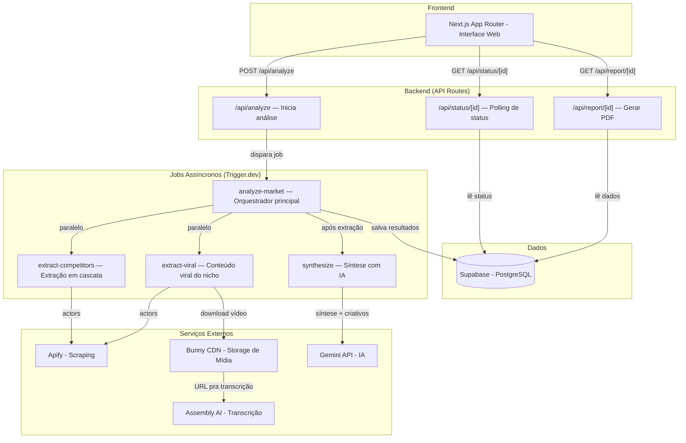
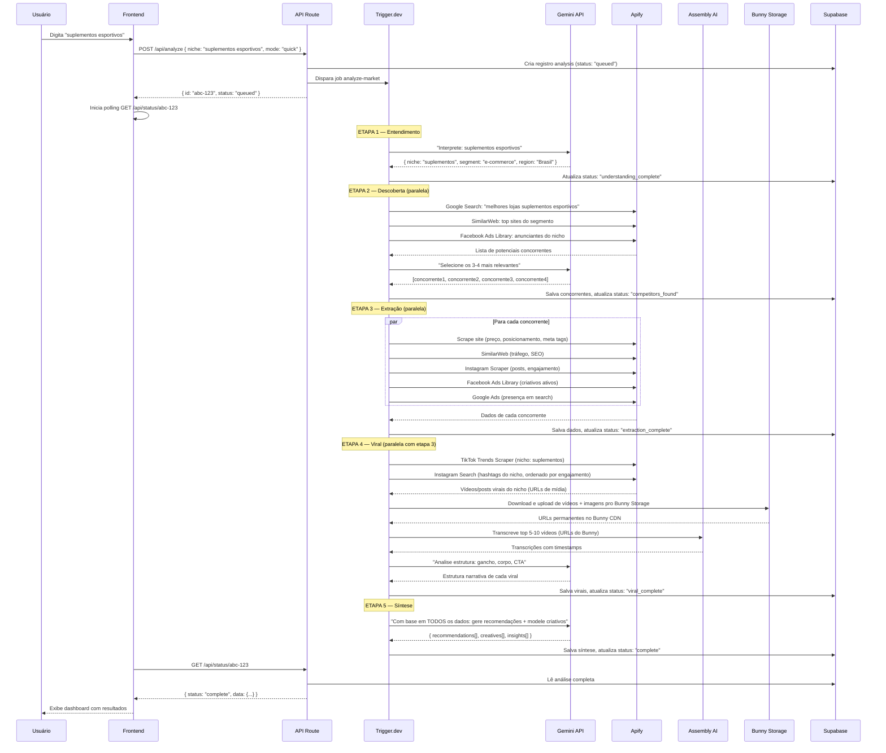
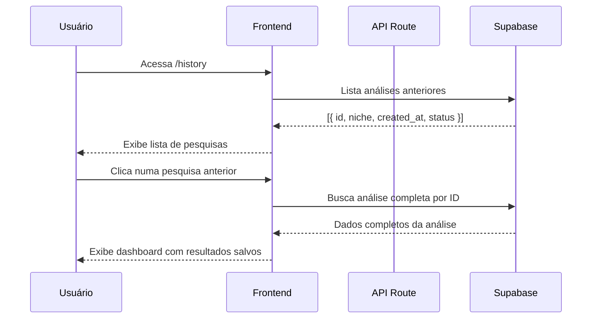
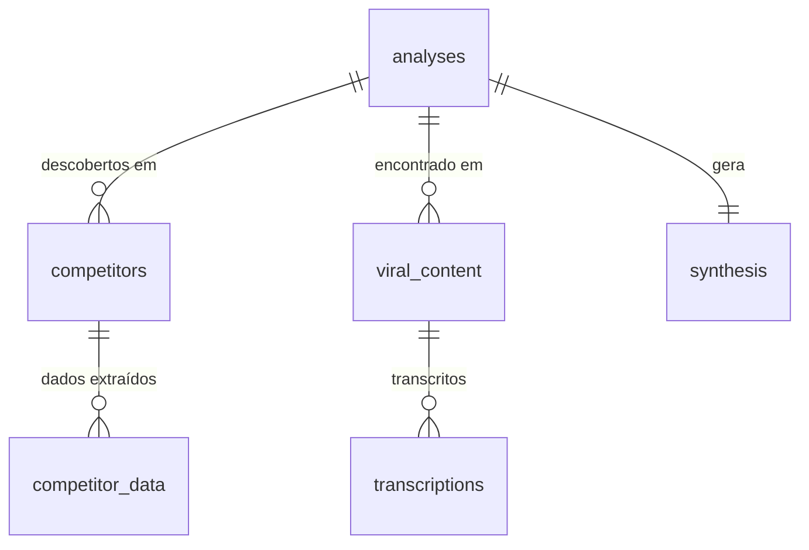
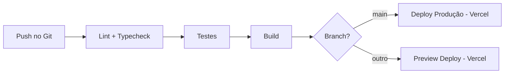

# ARCHITECTURE.md — LupAI

**Versão:** 1.0
**Última atualização:** 27/03/2026

---

## 1. Visão Geral

LupAI é uma aplicação web que funciona como um estrategista de marketing com IA. O usuário descreve um nicho de mercado (ou informa a URL do seu negócio), e o sistema executa uma cascata de análises paralelas: descobre concorrentes, extrai dados de múltiplas fontes (sites, redes sociais, anúncios, SEO), busca conteúdo viral do nicho, transcreve e analisa vídeos, e sintetiza tudo em recomendações estratégicas com modelagem de criativos.

A arquitetura é baseada em **jobs assíncronos** porque o processo completo de extração pode levar 1-5 minutos. O frontend dispara a análise e faz polling do status enquanto os jobs processam em background.

**Tipo de arquitetura:** Next.js Full-Stack + Background Jobs (Trigger.dev)

### Diagrama geral



---

## 2. Componentes

### 2.1 Frontend Web

| Aspecto | Detalhe |
|---------|---------|
| **Responsabilidade** | Interface do usuário: input, acompanhamento de progresso, dashboard de resultados, histórico |
| **Tecnologia** | Next.js 14 (App Router) + Tailwind CSS |
| **Localização no código** | `src/app/`, `src/components/` |
| **Comunica com** | API Routes via fetch/polling |
| **Estado** | React state + URL params pra navegação. Polling via hook customizado `usePolling` |

**Telas principais:**
1. **Homepage** (`/`) — Input central com campo de texto livre + toggle Modo Rápido/Completo
2. **Análise em progresso** (`/analysis/[id]`) — Barra de progresso com etapas da cascata em tempo real
3. **Dashboard de resultados** (`/analysis/[id]`) — Mesma rota, renderiza quando concluída: concorrentes, viral, recomendações
4. **Histórico** (`/history`) — Lista de pesquisas anteriores por nicho

### 2.2 API Routes (Backend)

| Aspecto | Detalhe |
|---------|---------|
| **Responsabilidade** | Receber requests, disparar jobs, servir dados do banco |
| **Tecnologia** | Next.js API Routes (App Router) |
| **Localização no código** | `src/app/api/` |
| **Comunica com** | Trigger.dev (dispara jobs), Supabase (lê/escreve dados) |
| **Autenticação** | Nenhuma (requisito do desafio) |

**Endpoints:**

| Método | Rota | Descrição | Resposta |
|--------|------|-----------|----------|
| POST | `/api/analyze` | Recebe input do usuário, cria registro no banco, dispara job | `{ id: "uuid", status: "queued" }` |
| GET | `/api/status/[id]` | Retorna status atual da análise + progresso das etapas | `{ status, progress, steps[] }` |
| GET | `/api/report/[id]` | Gera e retorna PDF do relatório | PDF binary |

### 2.3 Jobs Assíncronos (Trigger.dev)

| Aspecto | Detalhe |
|---------|---------|
| **Responsabilidade** | Executar toda a lógica pesada: scraping, transcrição, síntese com IA |
| **Tecnologia** | Trigger.dev v3 |
| **Localização no código** | `src/trigger/` |
| **Comunica com** | Apify (scraping), Gemini (IA), Assembly AI (transcrição), Supabase (persistência) |

**Jobs:**

| Job | Responsabilidade | Dependência |
|-----|-----------------|-------------|
| `analyze-market` | Orquestrador principal — coordena toda a cascata | Nenhuma (entry point) |
| `extract-competitors` | Pra cada concorrente: scrape site, SEO, redes sociais, anúncios | Após descoberta de concorrentes |
| `extract-viral` | Busca conteúdo viral do nicho (TikTok, Instagram, Facebook) + transcrição | Paralelo com extract-competitors |
| `synthesize` | Envia dados consolidados pra Gemini e gera recomendações + criativos | Após extract-competitors + extract-viral |

### 2.4 Banco de Dados (Supabase)

| Aspecto | Detalhe |
|---------|---------|
| **Responsabilidade** | Persistir análises, concorrentes, conteúdo viral, recomendações, status dos jobs |
| **Tecnologia** | Supabase (PostgreSQL) |
| **Hospedagem** | Supabase Cloud (free tier) |
| **Backup** | Automático pelo Supabase |

---

## 3. Fluxo de Dados

### Fluxo principal — Análise de mercado (Modo Rápido)



### Fluxo secundário — Modo Completo (com dados do negócio)

Mesmo fluxo acima, com adição:
- Após Etapa 1, o sistema também extrai dados do negócio do usuário (mesma cascata)
- Na Etapa 5, a síntese inclui cruzamento: "situação do usuário vs concorrentes"
- Recomendações são comparativas: "eles fazem X e você não"

### Fluxo de retorno — Pesquisa salva



---

## 4. Modelo de Dados

### Diagrama de relacionamentos



### Tabelas

#### analyses

Registro principal de cada análise iniciada pelo usuário.

| Coluna | Tipo | Obrigatório | Padrão | Descrição |
|--------|------|-------------|--------|-----------|
| id | uuid | sim | gen_random_uuid() | Identificador único |
| input_text | text | sim | — | Texto original digitado pelo usuário |
| mode | text | sim | 'quick' | 'quick' ou 'complete' |
| niche | text | não | — | Nicho interpretado pela IA |
| segment | text | não | — | Segmento (e-commerce, local, serviço) |
| region | text | não | — | Região identificada |
| user_business_url | text | não | — | URL do negócio do usuário (Modo Completo) |
| user_business_data | jsonb | não | — | Dados extraídos do negócio do usuário |
| status | text | sim | 'queued' | queued, processing, understanding_complete, competitors_found, extraction_complete, viral_complete, complete, error |
| progress | jsonb | não | '{}' | Progresso detalhado de cada etapa { step: status } |
| error_message | text | não | — | Mensagem de erro se falhar |
| trigger_job_id | text | não | — | ID do job no Trigger.dev |
| created_at | timestamptz | sim | now() | Data de criação |
| updated_at | timestamptz | sim | now() | Última atualização |

**Índices:**
- `idx_analyses_status` em `status` — filtragem por status
- `idx_analyses_niche` em `niche` — busca por nicho
- `idx_analyses_created_at` em `created_at` — ordenação cronológica

#### competitors

Concorrentes descobertos por análise.

| Coluna | Tipo | Obrigatório | Padrão | Descrição |
|--------|------|-------------|--------|-----------|
| id | uuid | sim | gen_random_uuid() | Identificador único |
| analysis_id | uuid | sim | — | FK pra analyses |
| name | text | sim | — | Nome do concorrente |
| website_url | text | não | — | URL do site |
| instagram_url | text | não | — | URL do Instagram |
| tiktok_url | text | não | — | URL do TikTok |
| facebook_url | text | não | — | URL do Facebook |
| google_maps_url | text | não | — | URL do Google Meu Negócio |
| relevance_score | numeric | não | — | Score de relevância (0-100) |
| created_at | timestamptz | sim | now() | Data de criação |

**Índices:**
- `idx_competitors_analysis` em `analysis_id` — busca por análise

#### competitor_data

Dados extraídos de cada concorrente por fonte.

| Coluna | Tipo | Obrigatório | Padrão | Descrição |
|--------|------|-------------|--------|-----------|
| id | uuid | sim | gen_random_uuid() | Identificador único |
| competitor_id | uuid | sim | — | FK pra competitors |
| source | text | sim | — | 'website', 'seo', 'instagram', 'tiktok', 'facebook_ads', 'google_ads', 'google_maps' |
| data | jsonb | sim | — | Dados brutos extraídos (estrutura varia por source) |
| extraction_status | text | sim | 'pending' | pending, success, error, skipped |
| error_message | text | não | — | Mensagem se extração falhou |
| extracted_at | timestamptz | não | — | Quando a extração foi concluída |
| created_at | timestamptz | sim | now() | Data de criação |

**Índices:**
- `idx_competitor_data_competitor` em `competitor_id`
- `idx_competitor_data_source` em `source`

#### viral_content

Conteúdo viral encontrado no nicho (independente dos concorrentes).

| Coluna | Tipo | Obrigatório | Padrão | Descrição |
|--------|------|-------------|--------|-----------|
| id | uuid | sim | gen_random_uuid() | Identificador único |
| analysis_id | uuid | sim | — | FK pra analyses |
| platform | text | sim | — | 'tiktok', 'instagram', 'facebook' |
| original_url | text | sim | — | URL original do post/vídeo na plataforma |
| bunny_media_url | text | não | — | URL da mídia hospedada no Bunny CDN |
| content_type | text | sim | — | 'video', 'image', 'carousel' |
| author | text | não | — | Quem postou |
| metrics | jsonb | não | — | { views, likes, comments, shares } |
| transcription | text | não | — | Transcrição do vídeo (se aplicável) |
| hook_analysis | text | não | — | Análise do gancho pela IA |
| body_analysis | text | não | — | Análise do corpo pela IA |
| cta_analysis | text | não | — | Análise do CTA pela IA |
| created_at | timestamptz | sim | now() | Data de criação |

**Índices:**
- `idx_viral_analysis` em `analysis_id`
- `idx_viral_platform` em `platform`

#### synthesis

Resultado da síntese com IA — recomendações e criativos.

| Coluna | Tipo | Obrigatório | Padrão | Descrição |
|--------|------|-------------|--------|-----------|
| id | uuid | sim | gen_random_uuid() | Identificador único |
| analysis_id | uuid | sim | — | FK pra analyses (unique) |
| recommendations | jsonb | sim | — | Array de recomendações estratégicas |
| creative_scripts | jsonb | não | — | Array de roteiros modelados (gancho, corpo, CTA) |
| market_overview | text | não | — | Resumo geral do mercado/nicho |
| competitive_gaps | jsonb | não | — | Gaps identificados (oportunidades) |
| seo_insights | jsonb | não | — | Insights de SEO do nicho |
| user_vs_market | jsonb | não | — | Cruzamento usuário vs mercado (Modo Completo) |
| created_at | timestamptz | sim | now() | Data de criação |

**Índices:**
- `idx_synthesis_analysis` em `analysis_id` (unique)

### Enums / Tipos customizados

| Nome | Valores | Usado em |
|------|---------|----------|
| analysis_status | queued, processing, understanding_complete, competitors_found, extraction_complete, viral_complete, complete, error | analyses.status |
| analysis_mode | quick, complete | analyses.mode |
| extraction_source | website, seo, instagram, tiktok, facebook_ads, google_ads, google_maps | competitor_data.source |
| content_platform | tiktok, instagram, facebook | viral_content.platform |
| content_type | video, image, carousel | viral_content.content_type |

---

## 5. Cascata de Extração — Detalhe dos Actors Apify

### Actors mapeados

| Necessidade | Actor Apify | Input esperado | Output principal |
|-------------|------------|----------------|-----------------|
| Scraping de site | Website Content Crawler | URL | Texto, meta tags, links, preços |
| SEO / Tráfego | SimilarWeb Advanced Scraper | Domínio | Tráfego estimado, fontes, keywords |
| Instagram | Instagram Scraper (oficial Apify) | Username ou URL | Posts, likes, comentários, frequência |
| TikTok vídeos | TikTok Scraper (clockworks) | Hashtags ou username | Vídeos, views, likes, shares |
| TikTok trends | TikTok Trends Scraper (clockworks) | Região, nicho | Hashtags trending, vídeos trending |
| Facebook Ads Library | Facebook Ads Scraper (oficial Apify) | Keyword ou Page URL | Criativos, copy, formato, duração |
| Google Maps | Google Maps Scraper (oficial) | Busca + região | Nome, avaliações, endereço, site |
| Google Ads | A definir | Domínio | Presença em search, keywords pagas |

### Estratégia de paralelismo

```
Etapa 1: Entendimento (IA)
    ↓
Etapa 2: Descoberta de concorrentes
    ↓
Etapa 3 + 4 (PARALELO):
    ├── Extração de cada concorrente (paralelo entre si)
    │   ├── Site ─────────┐
    │   ├── SEO ──────────┤
    │   ├── Instagram ────┤ Cada concorrente em paralelo
    │   ├── TikTok ───────┤ Cada fonte em paralelo
    │   ├── Facebook Ads ─┤
    │   ├── Google Ads ───┤
    │   └── Google Maps ──┘
    │
    └── Conteúdo viral do nicho (paralelo com extração)
        ├── TikTok Trends ──────────┐
        ├── Instagram hashtags ──────┤ Em paralelo
        └── Transcrição de vídeos ──┘
    ↓
Etapa 5: Síntese com IA (após tudo completar)
```

---

## 6. Decisões Técnicas

### DT-01: Trigger.dev pra jobs assíncronos

| Aspecto | Detalhe |
|---------|---------|
| **Decisão** | Usar Trigger.dev v3 pra toda lógica pesada (scraping, transcrição, síntese) |
| **Alternativas consideradas** | Vercel Serverless Functions (timeout de 60s), Inngest, QStash |
| **Motivo da escolha** | Sem limite de timeout, retry nativo, observabilidade, tier gratuito generoso, integração nativa com Next.js |
| **Consequências** | Adiciona uma dependência externa; precisa de conta no Trigger.dev |

### DT-02: Apify como hub central de scraping

| Aspecto | Detalhe |
|---------|---------|
| **Decisão** | Usar actors da Apify pra TODA extração de dados em vez de scrapers próprios |
| **Alternativas consideradas** | Playwright direto, Puppeteer, Cheerio, scraping manual |
| **Motivo da escolha** | Actors prontos e testados, manutenção pela comunidade, API padronizada, execução em cloud (sem infra própria), custo por resultado |
| **Consequências** | Dependência de terceiro; custos por uso; limitado aos dados que os actors expõem |

### DT-03: Gemini API como motor de IA

| Aspecto | Detalhe |
|---------|---------|
| **Decisão** | Usar Gemini 2.0 Flash pra entendimento, síntese e modelagem de criativos |
| **Alternativas consideradas** | Claude API (Sonnet), OpenAI (GPT-4o-mini) |
| **Motivo da escolha** | Free tier generoso, qualidade boa pra síntese, custo zero no MVP |
| **Consequências** | Qualidade pode ser ligeiramente inferior ao Claude/GPT-4o em nuances; rate limits do free tier |

### DT-04: Polling em vez de WebSocket

| Aspecto | Detalhe |
|---------|---------|
| **Decisão** | Frontend faz polling a cada 3-5 segundos em vez de usar WebSocket/SSE |
| **Alternativas consideradas** | WebSocket, Server-Sent Events, Supabase Realtime |
| **Motivo da escolha** | Mais simples de implementar, compatível com Vercel, funciona em todos os browsers, suficiente pra UX (progresso não precisa ser instantâneo) |
| **Consequências** | Pequeno delay entre atualização real e visualização (3-5s); mais requests ao servidor |

### DT-05: Dados brutos em JSONB

| Aspecto | Detalhe |
|---------|---------|
| **Decisão** | Armazenar dados de extração como JSONB em vez de tabelas normalizadas |
| **Alternativas consideradas** | Tabelas normalizadas pra cada tipo de dado |
| **Motivo da escolha** | Cada actor da Apify retorna estrutura diferente; normalizar tudo seria over-engineering pro MVP; JSONB permite queries flexíveis no PostgreSQL |
| **Consequências** | Menos type-safety no banco; queries podem ser mais lentas em volumes grandes (ok pro MVP) |

### DT-06: Bunny CDN + Storage pra toda mídia

| Aspecto | Detalhe |
|---------|---------|
| **Decisão** | Usar Bunny CDN + Storage pra hospedar toda mídia do projeto: vídeos, imagens, thumbnails, criativos de anúncios |
| **Alternativas consideradas** | Supabase Storage (1GB free tier limitado), Cloudflare R2 (mais config), referência de URLs originais (quebra quando post é deletado) |
| **Motivo da escolha** | Barato ($0.01/GB storage + $0.01/GB bandwidth), CDN rápido, centraliza toda mídia num lugar só. Necessário pra transcrição: Assembly AI precisa de URL acessível do vídeo — URLs do Instagram/TikTok são temporárias e protegidas |
| **Fluxo de vídeo** | Apify extrai URL do vídeo → Job faz download → Upload pro Bunny → Passa URL do Bunny pro Assembly AI → Transcrição |
| **Consequências** | Custo real de storage (centavos pro MVP); mais um serviço pra gerenciar; desativar quando não precisar mais |

### DT-07: Cache de resultados por nicho

| Aspecto | Detalhe |
|---------|---------|
| **Decisão** | Reutilizar dados de pesquisas recentes (< 24h) pro mesmo nicho em vez de rodar toda a cascata novamente |
| **Alternativas consideradas** | Sempre rodar análise do zero; cache mais longo (7 dias) |
| **Motivo da escolha** | Economiza créditos da Apify, reduz tempo de resposta pra nichos populares, dados de 24h ainda são relevantes |
| **Implementação** | Antes de disparar o job, verificar se existe análise do mesmo nicho com < 24h. Se sim, servir os dados existentes com opção de "Atualizar dados" |
| **Consequências** | Usuário pode ver dados levemente desatualizados (aceitável com 24h de janela); precisa de lógica de invalidação |

---

## 7. Infraestrutura e Deploy

### Ambientes

| Ambiente | URL | Hospedagem | Branch |
|----------|-----|-----------|--------|
| Desenvolvimento | localhost:3000 | Local | develop |
| Produção | lupai.gsdigitais.com | Vercel | main |

### Pipeline de deploy



### DNS

- Domínio `gsdigitais.com` gerenciado no Cloudflare
- Subdomínio `lupai.gsdigitais.com` → CNAME pra Vercel

---

## 8. Segurança

- [x] Variáveis sensíveis nunca estão no código (só em .env)
- [x] Sem autenticação (requisito do desafio)
- [x] API keys dos serviços externos ficam no backend (nunca expostas no frontend)
- [x] Input do usuário é validado com Zod antes de processar
- [x] Rate limiting básico na API (evitar abuso)
- [x] HTTPS em produção (Vercel provê automaticamente)
- [ ] RLS no Supabase — não necessário (sem autenticação, dados públicos)

---

## 9. Limitações Conhecidas

| # | Limitação | Motivo | Impacto |
|---|-----------|--------|---------|
| L01 | Scraping pode retornar dados incompletos | Sites mudam estrutura, actors podem falhar | Cada etapa é independente — falha parcial não quebra o produto |
| L02 | Descoberta de concorrentes pode trazer resultados irrelevantes | IA pode interpretar mal o nicho | Etapa de confirmação pelo usuário antes de extrair |
| L03 | Free tier do Gemini tem rate limits | ~15 requests/min no free tier | Suficiente pro MVP; escalar com plano pago se necessário |
| L04 | Transcrição só funciona pra vídeos públicos com áudio | Vídeos sem áudio ou privados não podem ser transcritos | Funcionalidade complementar, não core |
| L05 | Sem monitoramento contínuo | MVP faz análise on-demand, não monitora mudanças | Feature pro backlog futuro |
| L06 | Google Ads scraping pode ser limitado | Sem actor consolidado na Apify pra Google Ads | Implementar com best-effort; sinalizar se não disponível |
