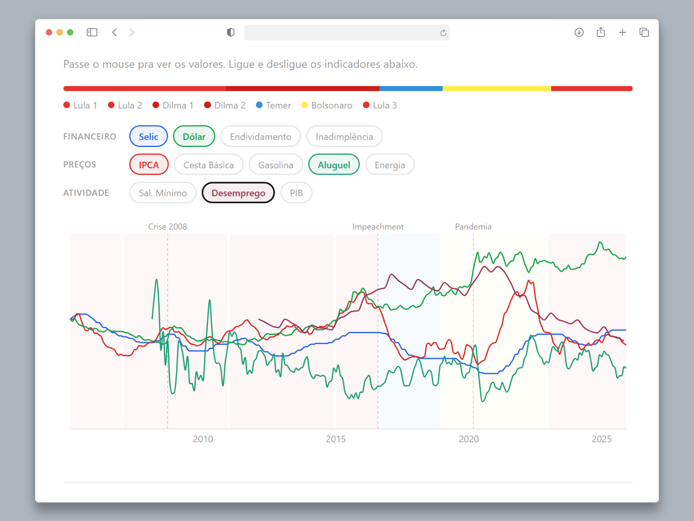

# O Custo de Vida do Brasileiro

Dashboard interativo que cruza 12 indicadores econômicos brasileiros dos últimos 20 anos, com dados oficiais do BCB, DIEESE, ANP, IBGE e FIPE.

**[Ver dashboard ao vivo →](https://calmai.pages.dev)**




## Sobre

Este projeto nasceu de uma pergunta simples: **quanto o dinheiro do brasileiro perdeu de valor em 20 anos?**

A resposta está nos dados. O dashboard cruza Selic, IPCA, dólar, salário mínimo, cesta básica, gasolina, endividamento, inadimplência, aluguel, energia elétrica, desemprego e PIB — todos extraídos automaticamente de APIs públicas — e apresenta a evolução com filtros por período de governo.

Os dados são atualizados semanalmente via pipeline automatizado.

## Indicadores

| Indicador | Fonte | Série | Período |
|-----------|-------|-------|---------|
| Taxa Selic (meta) | Banco Central — API SGS | 432 | 2005–presente |
| IPCA acumulado 12 meses | Banco Central — API SGS | 13522 | 2005–presente |
| Dólar comercial (compra) | Banco Central — API SGS | 3698 | 2005–presente |
| Salário Mínimo | Banco Central — API SGS | 1619 | 2005–presente |
| Endividamento das famílias | Banco Central — API SGS | 29037 | 2005–presente |
| Inadimplência | Banco Central — API SGS | 21082 | 2011–presente |
| Cesta básica (São Paulo) | DIEESE | Web scraping | 2005–presente |
| Gasolina (média nacional) | ANP | CSV série histórica | 2005–presente |
| Aluguel (FipeZAP) | FIPE | Download Excel | 2008–presente |
| Energia elétrica | IBGE | API SIDRA (tabelas 1419/7060) | 2012–presente |
| Desemprego (PNAD) | IBGE | API SIDRA (tabela 6381) | 2012–presente |
| PIB trimestral | Banco Central — API SGS | 22109 | 2005–presente |

## Arquitetura

O projeto tem duas partes independentes:

**Pipeline ETL (Python)** — Coleta dados de 5 fontes, normaliza e exporta como JSON.

**Dashboard (Next.js)** — Consome os JSONs e renderiza visualizações interativas.

Não existe backend rodando. O site inteiro é HTML estático servido pelo Cloudflare Pages.

```
Fontes (BCB, DIEESE, ANP, IBGE, FIPE)
        ↓
Pipeline Python (extração → transformação → exportação)
        ↓
Arquivos JSON estáticos (src/data/)
        ↓
Next.js SSG (build estático)
        ↓
Cloudflare Pages (CDN global)
```

## Stack

**Pipeline:** Python 3.11 · Pandas · Requests · BeautifulSoup4 · Pytest

**Dashboard:** Next.js 14 · TypeScript · Tailwind CSS · Recharts · Vitest

**Infra:** GitHub Actions · Cloudflare Pages

## Rodando localmente

### Pré-requisitos

- Python 3.11+
- Node.js 20+
- npm 10+

### Pipeline (dados)

```bash
cd pipeline
pip install -r requirements.txt
python main.py
```

### Dashboard

```bash
npm install
npm run dev
```

Acesse `http://localhost:3000`

### Testes

```bash
# Pipeline
cd pipeline && pytest -v

# Dashboard
npm test
```

### Build de produção

```bash
npm run build
npx serve out
```

## Pipeline ETL

O pipeline segue o padrão Extract → Transform → Load:

**Extract:** Cada fonte tem um extrator dedicado (`bcb.py`, `dieese.py`, `anp.py`, `fipezap.py`, `energia.py`, `ibge.py`). O extrator do BCB consulta a API SGS com retry automático. O do DIEESE faz scraping de tabela HTML. O da ANP parseia CSVs de séries históricas. O FipeZAP baixa Excel de séries históricas. Os do IBGE consultam a API SIDRA.

**Transform:** O normalizador padroniza datas (YYYY-MM), converte tipos numéricos, remove duplicatas, filtra pelo período configurado e agrega dados diários em médias mensais.

**Load:** O exportador gera 3 arquivos JSON (`indicators.json`, `governments.json`, `metadata.json`) otimizados pro consumo do frontend.

O pipeline roda automaticamente toda segunda via GitHub Actions. Se os dados mudaram, commita e faz deploy.

## Deploy

O deploy é feito automaticamente pelo GitHub Actions via Cloudflare Pages.

### Setup do Cloudflare Pages

1. Criar projeto `custo-de-vida-brasil` no dashboard do Cloudflare Pages
2. Adicionar custom domain (opcional)
3. Configurar secrets no GitHub (Settings → Secrets → Actions):
   - `CLOUDFLARE_API_TOKEN` — token de API com permissão de Cloudflare Pages
   - `CLOUDFLARE_ACCOUNT_ID` — ID da conta Cloudflare

## Contribuindo

Issues e PRs são bem-vindos. Se encontrou um dado errado ou tem sugestão de novo indicador, abre uma issue.

## Licença

[MIT](LICENSE)
